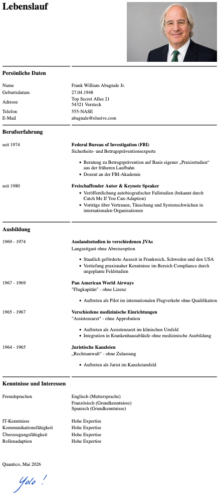

# html-only-practice-replicate-layout
 HTML-only practice project recreating a CV layout from a reference image

## Preview

## Overview
This project was created as part of an HTML/CSS practice exercise.
The assignment during a course I attended was to recreate a CV layout from a provided reference image using exclusively HTML.
Unfortunately I didn't save the original reference image, so this repository contains only my completed file.

## Objectives 
- practice HTML basics
- practice problem-solving with limited means (HTML-only)

## Technologies
- HTML
- No CSS or JavaScript; in line with the exercise's "HTML-only" constraint

## Additional Info: Backstory
The original task was to write our own CV based on the reference image. Since my actual CV is fairly extensive by now and time for that exercise was limited, I decided to create something different instead. As a 'normal' placeholder CV would not be really fun to do, I opted for creating a silly pseudo-CV for the imposter Frank Abagnale, widely known since the movie "Catch me if you can" came out.
In contrast to the forged CVs he was using, I intended to create a CV that actually showcases his false identities.

## Image Attribution and Disclaimer
This project includes an AI-generated portrait created with ChatGPT.
The portrait was generated using a reference photograph of Frank W. Abagnale from Wikimedia Commons:

    - Source: https://commons.wikimedia.org/wiki/File:Frank_W._Abagnale_in_2008.jpg
    - License: CC BY-SA 4.0 (https://creativecommons.org/licenses/by-sa/4.0/)

The AI-generated portrait is included solely as part of this educational project practicing HTML and entertainment purposes, and is not intended to imply any endorsement, affiliation, or representation by Frank Abagnale.